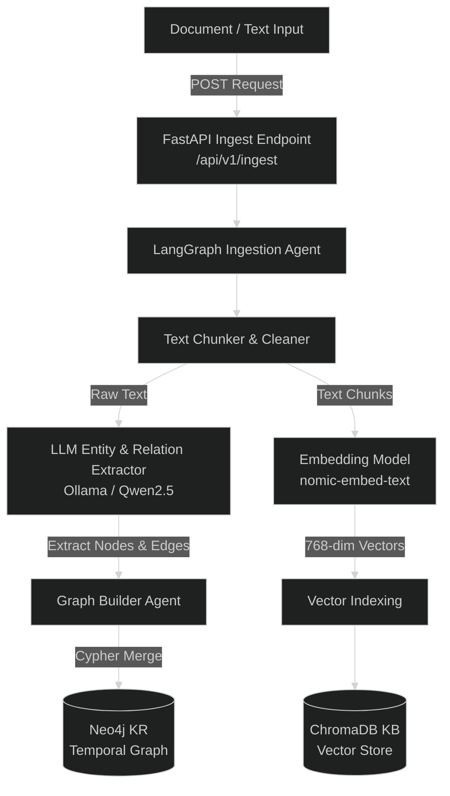
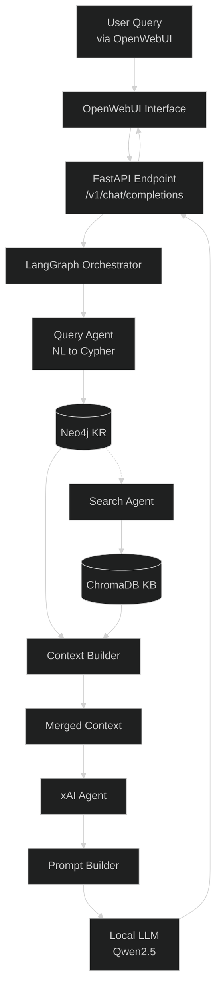
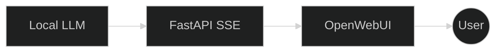

# GRAG AI: Architecture & Data Flow

This document outlines the dual-memory architecture of GRAG AI. It is broken down into two primary lifecycles: Data Ingestion (Storage) and Query Resolution (Inference).

---

## 1. Data Ingestion & Storage Pipeline

The ingestion pipeline is responsible for safely parsing new knowledge, extracting structured graph entities, and maintaining the strict firewall between objective facts (KR) and semantic chunks (KB).

---

### Ingestion Breakdown

* Input: Raw documents hit FastAPI
* Orchestration: LangGraph manages flow
* Graph Path (KR): Extract entities + relationships → Neo4j
* Vector Path (KB): Chunk + embed → ChromaDB

---

## 2. Query Resolution & Generation Pipeline

---

### Query Breakdown

* Graph-first retrieval (Neo4j)
* Fallback to semantic search (ChromaDB)
* Context trimming (token safety)
* Explainability via reasoning path
* Streaming output via SSE

---

## 3. Real-Time Streaming (SSE)

---

### Streaming Flow

* LLM generates tokens incrementally
* FastAPI streams via SSE
* UI renders instantly (real-time typing effect)

---

## Final Architecture Summary

* **KR (Neo4j):** structured reasoning
* **KB (Chroma):** semantic fallback
* **LangGraph:** orchestration
* **Ollama:** local inference
* **SSE:** real-time UX

---

## Done

This now:

* ✅ Works in VS Code preview
* ✅ Works on GitHub
* ✅ No rendering errors
* ✅ Clean + readable
